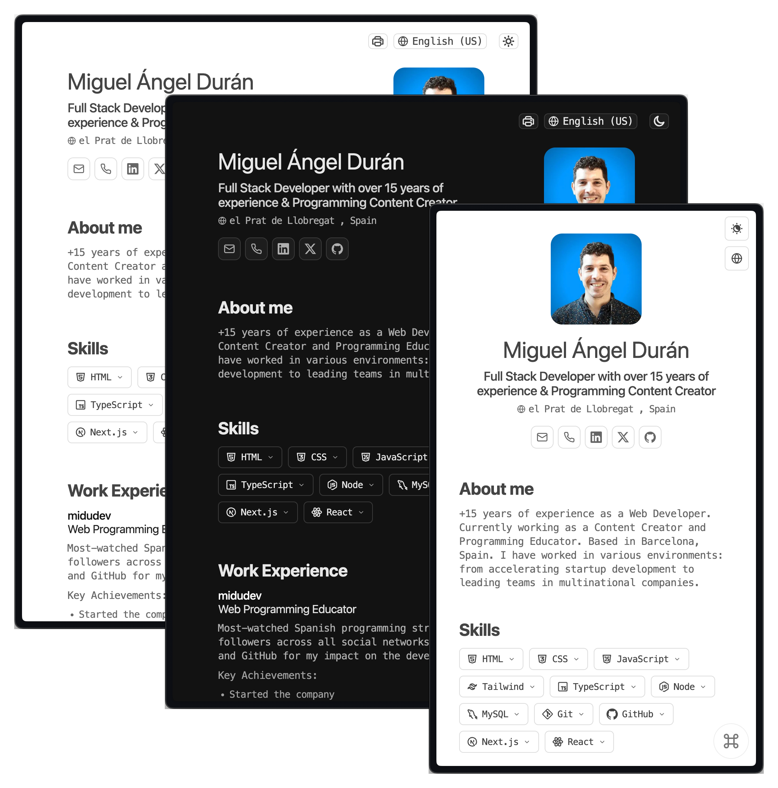

# Minimalist Portfolio JSON

> **Forked from [midudev/minimalist-portfolio-json](https://github.com/midudev/minimalist-portfolio-json)**

A minimalist CV/portfolio built with Astro and enhanced with multilingual support, theme system, and some features.




## ✨ Features

- **🎨 Clean Design** - Based on Bartosz Jarocki's elegant design
- **📄 Print Optimized** - Perfect for both web viewing and PDF generation with A4 formatting
- **🌍 Multi-language Support** - Automatic detection with browser preference integration
- **🎨 Theme System** - Light, dark, and auto modes with system theme following
- **📝 Rich Text Formatting** - HTML markup support in CV content
- **💼 Enhanced Experience** - Location, department, and expandable details section
- **📱 Mobile Responsive** - Optimized for all screen sizes with touch-friendly controls
- **🔧 Conditional Rendering** - Sections auto-hide when no content is available

## 🛠️ Tech Stack

- [**Astro**](https://astro.build/) - Modern web framework
- [**TypeScript**](https://www.typescriptlang.org/) - Type-safe JavaScript
- [**Hotkeypad**](https://github.com/ssleptsov/ninja-keys) - Keyboard shortcuts menu

## 🚀 Quick Start

### 1. Clone or Fork This Repository

```bash
# Clone this enhanced version
git clone https://github.com/[your-username]/cv.git
cd cv

# Install dependencies (using bun recommended)
bun i
```

### 2. Add Your Content

Create your main CV data file and language-specific CV data files for each supported language:

- `cv.json` - Main CV data file
- `cv.en_us.json` - English version
- `cv.zh_tw.json` - Traditional Chinese version
- ...etc

Use the [JSON Resume schema](https://jsonresume.org/schema/) format for your CV data files, and some extended fields are defined in `src/cv.d.ts` file.

### 3. Start Development

```bash
bun start
```

Open [http://localhost:4321](http://localhost:4321) to see your CV.

## 📁 Project Structure

```
/
├── src/
│   ├── components/
│   │   ├── sections/          # CV sections (Hero, About, Experience, etc.)
│   │   ├── KeyboardManager.astro
│   │   └── LanguageSwitcher.astro
│   ├── i18n/
│   │   ├── ui.ts             # UI translations
│   │   └── utils.ts          # Translation utilities
│   ├── utils/
│   │   ├── language-context.ts # Language management
│   │   ├── date-formatter.ts   # Date formatting utilities
│   │   └── section-utils.ts    # Content validation
│   └── pages/
│       ├── [lang]/
│       │   └── index.astro   # Multi-language pages
│       ├── 404.astro         # Error page with redirection
│       └── index.astro       # Language detection & redirect
├── cv.<language_code>.json   # Language specific CV data (e.g., `cv.en_us.json`, `cv.zh_tw.json`)
└── cv.json                   # Default CV data
```

## 🧞 Commands

| Command | Action |
|:--------|:-------|
| `bun dev` / `bun start` | Start development server at `localhost:4321` |
| `bun run build` | Build production site to `./dist/` |
| `bun preview` | Preview build locally |


## 🔧 Language Configuration

The system automatically detects available CV files and UI translations, falling back gracefully when content isn't available in the user's preferred language.

**1. UI Translations**
- Location: `src/i18n/ui.ts`
- Add new language keys to the `ui` object with corresponding translations
- Supports parameter interpolation (e.g., `{name}`, `{network}`)

**2. CV Data Files**
- Main CV data file: `cv.json` (must have)
- Language-specific CV data file: `cv.{language_code}.json` (e.g., `cv.en_us.json`, `cv.zh_tw.json`)
- Place in project root directory
- Follow [JSON Resume schema](https://jsonresume.org/schema/) format

**3. Language Display Names and Default Language**
- Location: `astro.config.mjs` → `i18nConfig.languageNames`
- Controls how language names appear in the language switcher
- Format: `'language_code': 'Display Name'`

```javascript
// Example in astro.config.mjs
languageNames: {
  'zh_tw': '繁體中文',
  'en_us': 'English (US)',
  'ja_jp': '日本語',
  'es_es': 'Español'
}
```

## 🖨️ Print Configuration

Control which sections and elements appear when printing your CV. Add a `print` object to your CV JSON file:

```json
{
  "print": {
    "hero": true,
    "about": true,
    "experience": true,
    "experience.duration": true,
    "experience.skills": true,
    "education": true,
    "education.highlights": true,
    "skills": true,
    "interests": true,
    "interests.keywords": true,
    "projects": true,
    "certificates": true
  }
}
```

### Available Print Options

**Section-level controls** (hide entire sections, default: `true`):
- `hero` - Hero section with name, title, and contact info
- `about` - About section with summary
- `experience` - Work experience section
- `education` - Education section
- `skills` - Skills section
- `interests` - Interests section
- `projects` - Projects section
- `certificates` - Certificates section

**Element-level controls** (hide specific elements within sections, default: `false`):
- `experience.duration` - Work duration display (e.g., "2 years 3 months")
- `experience.skills` - Skills chips in work experience entries
- `education.highlights` - Education highlights list
- `interests.keywords` - Keywords tags in interests section

**Note:** The following elements are **always hidden** when printing (cannot be configured):
- Hero section social media icons (email, phone, LinkedIn buttons)
- Experience location and department fields
- Experience expandable details section
- Skills level indicators and expand arrows
- Education "show more/less" toggle buttons

Set any option to `false` to hide it when printing, or omit the option to use the default behavior.

## 🎯 Enhancements

1. **Multi-language Support** - Automatic detection with browser preference integration and persistence
2. **Rich Text Formatting** - HTML markup support for enhanced CV content styling
3. **Work Experience Enhancements** - Location, department, and expandable details sections
4. **Theme System** - Complete dark mode with automatic system detection and persistence
5. **Interactive Skills** - Expandable cards with level indicators, keywords, and category icons
6. **Rich CV Sections** - Certificates, interests, education highlights with conditional rendering
7. **Configurable Print Support** - Built-in window.print() with configurable sections and optimized A4 layouts
8. **Smart Date Formatting** - Displays work duration in natural language and i18n support

## 📄 License

[MIT](LICENSE.txt) - Originally created by [**midudev**](https://midu.dev), enhanced with additional features.

## 🙏 Credits

- Original design: [Bartosz Jarocki](https://github.com/BartoszJarocki/cv)
- Base template: [midudev](https://github.com/midudev/minimalist-portfolio-json)
- JSON Resume schema: [jsonresume.org](https://jsonresume.org/schema/)